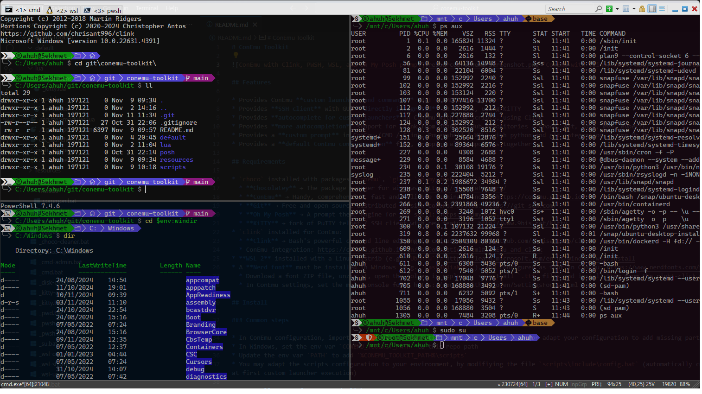

# ConEmu Toolkit



## Features

* Provides **custom launchers and commands** (BAT / CMD scripts) for ConEmu or Windows Terminal
* Provides **SSH client** with GUI **directly integrated** in ConEmu, using KiTTY
* Provides **custom launchers** with batch files (*update WSL distrib, update choco packages, open new terminal tab with split-screen, ...*)
* Provides **autocomplete** in CMD with LUA scripts, using Clink (*mvn with dynamic profiles completion, ...*)
* Provides **more autocompletion** support for Clink from other GitHub repositories (*choco, git, java, kubectl, ...*)
* Provides a **custom prompt** in ConEmu or Windows Terminal (CMD / Clink, Powershell & WSL) with python and git integration, using Oh My Posh
* Provides a **default configuration** file for ConEmu or Windows Terminal, wrapping all components together

## Requirements

* **Windows Terminal** → Modern, fast, efficient, powerful, and productive terminal application for users of command-line tools and shells like Command Prompt, PowerShell, and WSL: https://aka.ms/terminal
* `choco` installed with packages `conemu`, `git`, `oh-my-posh` and `kitty`
  * **Chocolatey** → The package manager for windows: https://chocolatey.org/
  * **ConEmu** → Handy, comprehensive, fast and reliable terminal window: https://conemu.github.io/
  * **Git** → Free and open source distributed version control system: https://git-scm.com/
  * **Oh My Posh** → A prompt theme engine for any shell: https://ohmyposh.dev/
  * **KiTTY** → fork of PuTTY telnet / SSH client with new features: http://www.9bis.net/kitty
* `clink` installed for ConEmu:
  * **Clink** → Bash's powerful command line editing in cmd.exe: https://github.com/chrisant996/clink
  * ConEmu integration: https://conemu.github.io/en/TabCompletion.html#ConEmu_and_clink
* **WSL 2** installed with a Linux distrib (e.g. `Ubuntu`): https://learn.microsoft.com/en-us/windows/wsl/install
* A **Nerd font** must be installed in Windows (e.g. `CaskaydiaMono`), and configured as font in ConEmu: https://www.nerdfonts.com/font-downloads
  * Download a font ZIP file, unzip it, open the folder in explorer, select all `.ttf` files and install them from the right-click menu
  * In ConEmu settings, set the main console font: https://conemu.github.io/en/SettingsFonts.html

## Install

### Common steps

* Import the default configuration it the terminal client:
  * **For ConEmu**: In ConEmu configuration, import the default configuration available in this repo (or adapt your configuration to add missing parts): `default/conemu/ConEmu.xml`
  * **For Windows Terminal**: In Windows Terminal settings, click on 'Open JSON file' and replace the content of the `settings.json` file by: `default/wt/settings.json`
* In Windows, set the env var `CONEMU_TOOLKIT_PATH` to this repo path
* Update the env var `PATH` to add `%CONEMU_TOOLKIT_PATH%\scripts`
* You may adapt the scripts configuration to your environment, by modifiying the file `scripts\include\config.bat` (automatically created from `config.default.bat` at first custom launcher execution)
  * In `scripts\include\config.bat`, choose the terminal client to use: `CEL_TERM_CLIENT` = `CONEMU` or `WT`

### Install prompt for CMD

* Prerequisite: install Clink for CMD
  * If you want to use **Clink in ConEmu**, use the default configuration `default/conemu/ConEmu.xml`
  * If you want to use **Clink in Windows Terminal** (already configured in the default configuration `default/wt/settings.json`)
    * Change the CMD command line in Terminal settings
      * Replace the default value... : `%SystemRoot%\System32\cmd.exe`
      * .. by this value with Clink injection: `%SystemRoot%\System32\cmd.exe /K "%PROGRAMFILES%\ConEmu\ConEmu\clink\clink.bat" inject`
    * Select the `CaskaydiaMono NF` font in Terminal settings

* In a CMD, execute these lines to register LUA scripts for Clink and custom prompt with **Oh My Posh**:

```bat
clink installscripts "%CONEMU_TOOLKIT_PATH%\lua"
```

* Do the same operations to register MORE scripts:
  * From the repo `clink-completions`: https://github.com/vladimir-kotikov/clink-completions?tab=readme-ov-file#using-git

* NOTE: if you made a mistake while registering scripts, use this command to reset registry → `clink uninstallscripts --all`

* **BONUS**: if you want to use **ConEmu with Clink in VSCode integrated terminal**, add and adapt the following **User Settings** to your environment:

```json
{
    "terminal.integrated.defaultProfile.windows": "ConEmu",
    "terminal.integrated.profiles.windows": {
      "ConEmu": {
        "overrideName": true,
        "path": "${env:windir}\\System32\\cmd.exe",
        "args": ["/K", "${env:ProgramFiles}\\ConEmu\\ConEmu\\CmdInit.cmd"],
        "icon": "terminal"
      }
    },
    "terminal.integrated.fontFamily": "CaskaydiaMono NF"
}
```

### Install prompt for Powershell

* In both Powershell (`pwsh.exe` and `powershell.exe`), use your preferred editor to modify the profile file: `notepad++ $PROFILE.CurrentUserAllHosts`
  * Add shortcut to close shell with `Ctrl+D` (OPTIONAL),
  * Disable prediction in input for **pwsh** only (OPTIONAL),
  * Add prompt at the end of file: https://ohmyposh.dev/docs/installation/prompt

  ```powershell
  # Add shortcut to close shell with Ctrl+D
  Set-PSReadlineKeyHandler -Key ctrl+d -Function ViExit

  # Disable prediction (in pwsh only)
  Set-PSReadlineOption -PredictionSource None
  
  # Register Oh My Posh prompt
  oh-my-posh init pwsh --config "$env:CONEMU_TOOLKIT_PATH/posh/themes/ahuh-conemu.json" | Invoke-Expression
  ```

### Install prompt for WSL

* In Windows, set the env var `WSLENV`: https://devblogs.microsoft.com/commandline/share-environment-vars-between-wsl-and-windows/
  * Add `USERPROFILE/p:CONEMU_TOOLKIT_PATH/p` to the `:` separated list (if exists)
* Install **Oh My Posh** in WSL:
  * Install in a shared dir, to be used for local user and root (reference: https://ohmyposh.dev/docs/installation/linux):

  ```shell
  # Create shared dir for 'Oh My Posh' install
  sudo mkdir -p /opt/ohmyposh
  sudo chown -R $(id -u):$(id -g) /opt/ohmyposh
  sudo chmod 775 /opt/ohmyposh
  
  # Install 'Oh My Posh'
  # Ignore the warning about PATH env var
  curl -s https://ohmyposh.dev/install.sh | bash -s -- -d /opt/ohmyposh

  # Add user common link to 'Oh My Posh' executable
  sudo ln -s /opt/ohmyposh/oh-my-posh /usr/local/bin/
  ```

* In WSL, use your preferred editor to modify the bashrc file: `nano ~/.bashrc`
  * Add prompt at the end of file (reference: https://ohmyposh.dev/docs/installation/prompt):

  ```shell
  # Register 'Oh My Posh' prompt
  eval "$(oh-my-posh init bash --config $CONEMU_TOOLKIT_PATH/posh/themes/ahuh-conemu.json)"
  ```

* In WSL, repeat operation to configure **Oh My Posh** for root user: `sudo su`
  * First you will need to pass the env var to the root user, by modifying the sudoers configuration: `sudo visudo`

  ```shell
  sudo su
  cd /etc/sudoers.d
  echo "# For the Oh My Posh prompt registration" > prompt-posh
  echo "Defaults:%sudo env_keep += \"USERPROFILE CONEMU_TOOLKIT_PATH\"" >> prompt-posh
  ```

  * Update root's bashrc file to add prompt at the end of file (see previous step)
